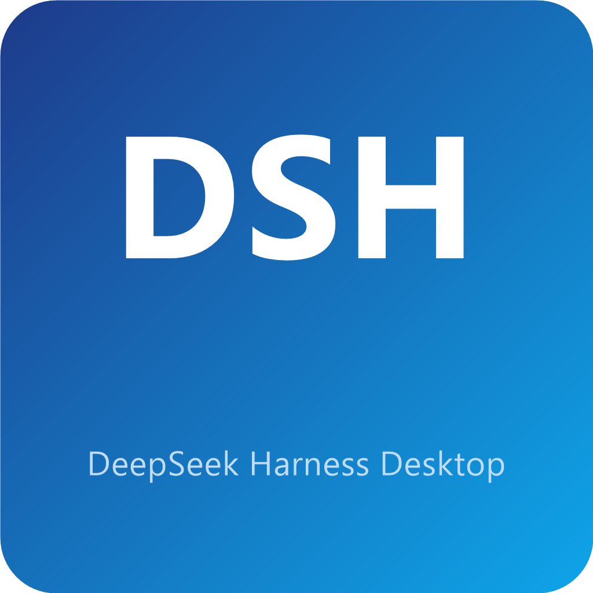
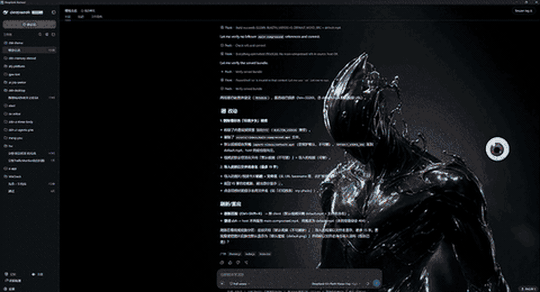
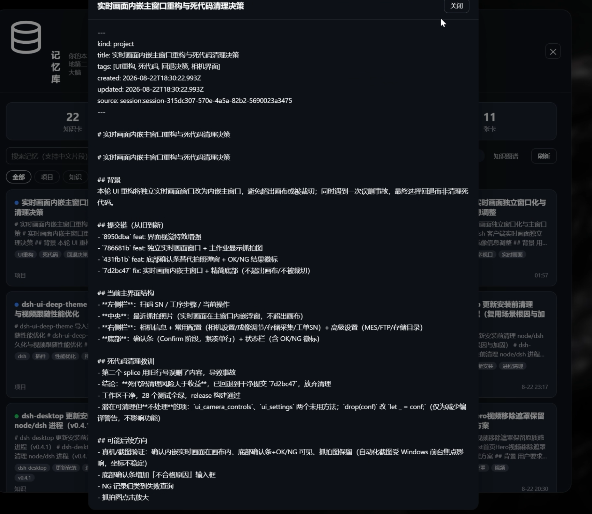

<div align="center">
  
  <h1>dsh-desktop · DeepSeek Harness 桌面工作台</h1>
  <h3>🖥️ AI 打工人的快乐老家 —— <b>会动的桌面</b> · <b>记忆 · 主题 · 驯兽师</b>全套原创插件 · 508 像素专家随叫随到 · 自动更新 · 双击即用</h3>
  <p>
    
    
    
    
    
    
  </p>
  <p>
    <a href="https://gitee.com/eternalnight996/dsh-desktop/releases">📦 立刻下载</a> |
    <a href="https://gitee.com/eternalnight996/dsh-desktop">🌟 Gitee</a> |
    <a href="https://github.com/EternalNight996/dsh-desktop">🐙 GitHub</a> |
    <a href="LICENSE">📄 License</a>
  </p>
</div>

<!-- ⭐ 展示导览：主 GIF（会动的桌面）置顶，下方按插件/功能展开 -->
<p align="center">
  
</p>

---

> **一句话读懂它**：不用装 Node、不用开终端、不用敲任何命令 —— **双击图标**，一个「有人味」、**会动**、还**带记忆**的 AI 工作台就自动出现：
>
> 🧑‍💼 这是**会动的桌面**：508 位像素专家在办公室里走来走去、互相闲聊、随时听你差遣；再配上**记忆核心**（对话自动沉淀知识）、**主题皮肤**（360 跟随换肤）、**驯兽师内核**（让智能体更懂人）——一个自成一体的 AI 工作台。
>
> 基于官方 [deepseek-harness](https://github.com/deepseek-ai/deepseek-harness) 打包 —— 不 fork、不改源码，官方更新即用。

## ✨ 三大卖点

### 🧑‍💼 会动的桌面 + 全套原创插件：自成一体的 AI 工作台

**核心是「会动的桌面」**——把 **508 张完整角色卡**（The Agency 255 + agency-agents-zh 253，17 个部门）变成**会动的像素小人**：

- 🚶 他们**走来走去**、敲电脑、下班躺床，办公室里有饮水机、书架、吊灯
- 💬 他们**互相闲聊**，还能接 AI 让台词更像人
- 👑 一键**团队编排**：29 个预设团队（研发 / 安全 / AI大模型 / 区块链 / 跨境电商…），角色名配**历史名人**——图灵、霍金、刘慈欣、辛顿，都是你的同事
- 🔍 每个会话专属办公室，**重启不丢**，状态持久化；Canvas 2D 像素小人可站立、打字、踱步，浮层可**拖动折叠缩放**

**再配上原创插件，让它更「活」、更聪明**：

- 🧠 **记忆核心**（`dsh-memory-eternal`）：对话**自动沉淀知识卡**到本地 Markdown Vault（去重 / 检索 / 知识图谱），零人工干预，纯本地
- 🎨 **主题皮肤**（`dsh-theme`）：内置主题 / 静态图 / **动态 360 跟随视频**，一键换肤
- 🦾 **驯兽师内核**（`dsh-ui-three-body`）：第一性原理 + 需求剖析 + 极简沟通 + 最少 token，让智能体更懂「人话」
- 🔌 全部**一键加装**（`just install-plugins`，见下方「原创插件全家桶」），桌面壳默认不内置、不捆绑

### 🔄 自动更新，永远最新

桌面壳自己会**每次启动自动检查新版本**：发现更新 → 自动打开设置窗口弹出「是否立即更新」（可勾选「下次不提醒此版本」）→ 一键下载安装 → 自动重启。更新入口常驻**系统托盘**（右键：打开主窗口 / 设置 / 检查更新 / 退出），设置窗口里也能手动检查。

在线版 dsh 启动直接使用**全局安装**（`%APPDATA%\npm`，与终端 dsh 命令同源），**后台检查官方新版本**，在设置窗口**一键升级**；更新源**双端互备**（国内自动走 Gitee，失败回退 GitHub），就算某一天某一边抽风，另一边照样能更。

### ⚡ 随叫随到：托盘常驻，一唤即开

**关闭窗口会最小化到托盘（不退出），dsh 服务随桌面壳一并常驻后台**；托盘「打开主窗口」即可**秒开**、不再重建 dsh 服务。打开它、关掉它、再点开它，都在一瞬间——就像桌面上一个「随叫随到」的同事，真正退出才用托盘右键「退出」。

## 🖼️ 界面预览 · 原创插件全家桶

> 📸 全部真实抓屏，顶部 GIF 是整体总览。会动的桌面、主题、记忆、驯兽师内核、自动更新都由**可选插件**提供，桌面壳默认不内置。

### 🔌 一键安装所有原创插件

桌面壳已经把终端 `dsh` 统一到同一份（零下载），装插件**不会重装 dsh**。一条命令装齐 4 个原创插件（从 GitHub 源安装，不经过 npm）：

```sh
just install-plugins        # 或直接运行 scripts/install-plugins.ps1（Windows 双击）
```

### 🧑‍💼 会动的桌面 · 像素办公室（[dsh-ui-agents-pixe](https://github.com/EternalNight996/dsh-ui-agents-pixe)）
<p align="center">
  
  
</p>
**508 张完整角色卡**（The Agency 255 + agency-agents-zh 253，17 部门）；Canvas 2D 像素小人可站立、打字、踱步，浮层可拖动折叠缩放，选人即入列，闲聊可接 AI。

### 🎨 主题皮肤（[dsh-theme](https://github.com/EternalNight996/dsh-theme)）
<p align="center">
  
  
</p>
内置主题 / 静态图 / **动态 360 跟随视频**，一键换肤，桌面更像「活」的。

### 🧠 记忆核心（[dsh-memory-eternal](https://github.com/EternalNight996/dsh-memory-eternal)）
<p align="center">
  
  
</p>
对话自动沉淀**知识卡**到本地 Markdown Vault（去重 / 检索 / 知识图谱），零人工干预，纯本地。

### 🦾 驯兽师内核（[dsh-ui-three-body](https://github.com/EternalNight996/dsh-ui-three-body)）
<p align="center">
  
  
</p>
把「人话」翻译给智能体：第一性原理 + 需求剖析 + 极简沟通 + 最少 token，让智能体更「开智」；左上角萌宠开关，设置面板可配内核档位。

### ⚙️ 自动更新
<p align="center">
  
</p>
「更新配置」入口已移至 dsh 工作栏底部 **设置** 之前（记忆 → 更新配置 → 设置）。点开即弹出独立**设置·更新配置窗口**：内置桌面壳与 dsh 双更新入口、版本与运行方式一览、随时一键升级。关闭主窗口会最小化到托盘，更新配置常驻托盘与设置窗口。

## 🚀 三步上手

| 步骤 | 做什么 | 多久 |
|---|---|---|
| **1️⃣ 下载** | 从 [Gitee Releases](https://gitee.com/eternalnight996/dsh-desktop/releases)（或 [GitHub Releases](https://github.com/EternalNight996/dsh-desktop/releases)）选你的平台 | 1 分钟 |
| **2️⃣ 安装** | 双击安装包，一路下一步 | 1 分钟 |
| **3️⃣ 双击运行** | 图标一点，自动启动，**直接开聊** | 10 秒 |

| 平台 | 安装包 |
|---|---|
| Windows | `*-setup.exe` / `.msi` |
| macOS | `.dmg` / `.app` |
| Linux | `.deb` / `.AppImage` / `.rpm` |

**安装小贴士**：

- **Windows**：双击 `setup.exe` → 一路「下一步」。若弹出 SmartScreen「已阻止运行」→ 点「更多信息」→「仍要运行」（未签名版正常现象）；装完桌面会出现图标。
- **macOS**：打开 `.dmg` → 把 App 拖进「应用程序」；首次打开提示「无法验证开发者」→ 右键图标 →「打开」。
- **Linux**：`.deb` 用 `sudo dpkg -i xxx.deb`（或双击）；`.AppImage` 先 `chmod +x` 再运行。

> 💡 想要完全离线？下载**离线安装包**（文件名带 `offline`）：Node + WebView2 + dsh 全内置，断网也能装、也能跑。

## 🎨 扩展：插件市场 + 更多插件

桌面壳**不内置**任何插件；所有插件都用统一 `dsh` 命令安装（桌面壳已把终端 `dsh` 统一到同一份，**零下载，不会重装 dsh**）。想第一个装**插件市场**（界面浏览/搜索/一键安装所有插件）：

```sh
dsh plugin add dshmarket
```

安装后重启桌面壳，设置页出现「插件市场」入口（[dsh-market/dsh-market](https://github.com/dsh-market/dsh-market)）。

**原创插件全家桶**（会动的桌面 / 主题 / 记忆 / 驯兽师内核）见上方「界面预览 · 原创插件全家桶」，`just install-plugins` 一键装齐；也可单独装某个：`dsh plugin --profile web add github:EternalNight996/<仓库名>`。

## ❓ 常见疑问（大白话版）

**Q：我需要会编程吗？**
A：完全不用。这是给「人」用的，双击就完事。

**Q：它和 DeepSeek Harness 是什么关系？**
A：它是 DeepSeek Harness 的「桌面皮肤 + 保姆」：负责帮你拉起服务、开窗口、加彩蛋；对话、模型配置还是官方原汁原味。

**Q：我的数据会传出去吗？**
A：角色、状态全在**本机**（`~/.dsh/`），纯本地、零外传、零 LLM 开销。

**Q：官方更新了怎么办？**
A：在线版桌面壳启动时**直接使用全局安装的 dsh**（`%APPDATA%\npm`，与终端 dsh 命令同源；首次联网自动安装到全局，后台只检查版本，发现新版提示你点击「更新 dsh」一键升级），桌面壳自身也自动更新——你不用管，永远最新；离线版由维护者 `just update-offline` 更新内置 dsh 后重新打包。

**Q：像素人会偷懒吗？**
A：会摸鱼（下班躺床），但该干活时打字飞快 —— 这才是真实的打工人。

## 👨‍💻 给开发者的话（折叠）

<details>
<summary>点击展开：源码构建 / 更新 / 打包 / 架构（普通用户可跳过）</summary>

### 从源码构建（速览）

构建依赖 **Rust** + **just** + **Tauri CLI**，顺序：`just setup`（装 Tauri CLI）→ `just vendor`（准备运行时）→ `just dev`（开发）/ `just dist`（构建）。Linux 另需 `just setup-linux`。

> 📖 **完整保姆级教程（每步带验证 + 常见坑）见文末「🔧 安装部署教程」**。

真实运行日志：

```
[dsh-desktop] 使用内置 dsh（离线模式）: ...\dsh-runtime\node_modules\@deepseek-ai\dsh\lib\bin.js
[dsh:out] dsh web: http://127.0.0.1:57222
```

### 常用命令速查

| 命令 | 作用 |
|---|---|
| `just setup` | 安装 Tauri CLI（`cargo install tauri-cli --locked`） |
| `just vendor` | 准备运行时（node/npm sidecar + 内置 dsh） |
| `just dev` / `just dist` | 开发运行 / 拉取构建 |
| `just dist-offline` | 离线构建（内置 dsh） |
| `just update` | 自动查 npm 官方 dsh 最新版并升级**全局 dsh**（`%APPDATA%\npm`，与桌面壳在线 dsh 同源），不改源码 |
| `just update-offline` | 拉取最新 dsh 到离线 runtime（`vendor/dsh-runtime`），供离线打包用 |
| `just release-*` / `release-*-offline` | 带签名 / 离线发布构建 |
| `just keygen` | 生成更新签名密钥（一次性） |
| `just icon` | 生成图标 |

### 桌面壳自动更新（速览）

基于 `tauri-plugin-updater`：启动自检新版本，一键下载安装并重启；**双源互备**（GitHub Releases + Gitee 发行版的 `latest.json`，国内自动走 Gitee）。发布新版本：

- **跨平台全自动（推荐）**：推 `v*` tag，GitHub Actions（`.github/workflows/release.yml`）自动三平台构建、签名、发布到 GitHub + Gitee 双发行版；需仓库 secret `TAURI_SIGNING_PRIVATE_KEY` + `GITEE_TOKEN`。
- **本机一键（Windows）**：`just release-publish "更新说明"`（带签名 NSIS 构建 → latest.json → GitHub Releases → 打 tag）。

> 📖 **完整保姆级配置教程（keygen / Secrets / 发布 / 排错）见文末「🔄 自动更新配置教程」**。

### 三种 WebView2 打包方式

| 方式 | `webviewInstallMode` | 命令 | 行为 |
|---|---|---|---|
| 用系统自带（默认） | `skip` | `just dist` / `just release-*` | 用系统自带 WebView2，安装包最小 |
| 在线安装 | `downloadBootstrapper` | `just dist-online` / `just release-online` | 安装时联网下载 WebView2 |
| 离线安装 | `offlineInstaller` | `just dist-offline` / `just release-*-offline` | 内置 WebView2 + dsh，完全离线 |

> **离线**模式还会内置 dsh（`@deepseek-ai/dsh`）；**在线**模式首次联网自动安装 dsh 到全局 npm 前缀（`%APPDATA%\npm`，与终端 dsh 命令同源），之后直接用内置 node 启动（无需 npx）；后台只检查版本，发现新版由你点「更新 dsh」手动升级。

#### 离线打包（速览）

Node sidecar（`node-<triple>[.exe]`）+ 内置 dsh + WebView2 离线安装器（`offlineInstaller`，而非默认安装时联网下载的 `downloadBootstrapper`），**断网可装、断网可跑**。

> 📖 **完整 4 步离线打包教程见文末「🔧 安装部署教程」的「离线打包教程」**。

### 跨平台构建

同一套 Rust 代码，差异只在 node sidecar 二进制与系统 WebView：

| 平台 | node sidecar 文件名 | WebView | 安装包 |
|---|---|---|---|
| Windows x64 | `node-x86_64-pc-windows-msvc.exe` | WebView2 | NSIS / MSI |
| macOS Apple Silicon | `node-aarch64-apple-darwin` | WKWebView | dmg / app |
| macOS Intel | `node-x86_64-apple-darwin` | WKWebView | dmg / app |
| Linux x64 | `node-x86_64-unknown-linux-gnu` | WebKitGTK | deb / AppImage / rpm |

> 在**目标平台**运行 `just vendor`，自动识别架构复制对应 node 二进制；不支持跨 OS 编译（原生构建或 CI 矩阵）。

### 与手动方案对比

| | 手动 `npx dsh web` | Electron 壳 | **本壳（Tauri）** |
|---|---|---|---|
| 装 Node | 要 | 免 | **免** |
| 自动启动 dsh | ❌ 手动 | ✅ | ✅ |
| dsh 引擎更新 | 手动 npm | 手动 | **✅ 在线后台检查 + 手动一键；离线 `just update-offline` 一键** |
| 桌面壳自动更新 | ❌ | 手动 | **✅ 启动自检 + 一键更新** |
| 内置插件（开箱彩蛋） | ❌ 需自装 | ❌ 需自装 | ❌ 需自装（独立插件一键加装） |
| 像素人角色管理 | ❌ | ❌ | ❌ 需自装（508 角色 / 29 团队） |
| 安装包体积 | — | ~200MB+ | **壳 ~12MB（+运行时）** |
| 离线零依赖 | ❌ | 部分 | **✅（离线方案）** |
| 内存占用 | — | 高 | 低 |

### 架构与目录

- 决策记录见 [ADR-001](docs/rules/05-adr/001-load-remote-webui.md)（加载远端 dsh Web UI，因 dsh 前端依赖服务端注入 `__DSH_BOOT__`，非静态站点）
- 目录：`src-tauri/`（Rust + sidecar + 配置）、`src/`（加载页）、`vendor/`（运行时产物，`just vendor` 生成，不入库）、`scripts/`
- 可选插件：`dshmarket`（插件市场，界面浏览/一键安装）与 `dsh-ui-agents-pixe`（像素办公室，独立 npm 包 / 独立仓库维护，桌面壳**不内置**）——按需 `dsh plugin add` 安装，不改 dsh 源码
- 提交规范：feat/fix/chore/docs/refactor/test；semver 打 tag；GUI 文档配真实截图

</details>

## 🔧 安装部署教程（详细版）

从源码构建的**完整保姆级流程**，每步带「验证」与「常见坑」，照做即可。

**前置条件**：Windows 10/11 或 macOS 或 Linux（Ubuntu/Debian），能联网，预留约 2GB 磁盘空间。

### ① 安装 Rust（rustup）

- **Windows**：打开 [rustup.rs](https://rustup.rs) 下载 `rustup-init.exe` → 双击 → 一路默认 → 装完**务必重开一个终端**（PATH 才生效）。
- **macOS / Linux**：
  ```sh
  curl --proto '=https' --tlsv1.2 -sSf https://sh.rustup.rs | sh
  source "$HOME/.cargo/env"
  ```
- ✅ **验证**：新终端里执行 `rustc --version && cargo --version`，能打印版本号即成功。
- ⚠️ **坑**：提示 `'rustc' 不是内部或外部命令` → 没重开终端；Windows 上确认 `%USERPROFILE%\.cargo\bin` 在 PATH。

### ② 安装 just（命令执行器，一般不会预装）

- 已装 Rust：`cargo install just`
- **Windows**：`winget install casey.just`（或 `scoop install just`）
- **macOS**：`brew install just`
- **Ubuntu/Debian**：`sudo apt install just`
- ✅ **验证**：`just --version` 能打印版本号即成功。

### ③ 安装 Tauri CLI（一次性）

```sh
just setup        # = cargo install tauri-cli --locked，编译约几分钟
```

- Linux（Ubuntu/Debian）还需系统依赖：`just setup-linux`
- ✅ **验证**：`cargo tauri --version` 能打印版本号即成功。

### ④ 准备运行时（node/npm sidecar，离线还需 dsh）

```sh
just vendor
```

- 这一步下载 node sidecar 并复制到 `src-tauri/binaries/`；离线方案还会把 dsh 装进 `vendor/dsh-runtime/`。
- ✅ **验证**：`src-tauri/binaries/` 下有 `node-<平台>.exe`（Windows）或 `node-<平台>`（macOS/Linux）。

### ⑤ 开发运行 / 构建

```sh
just dev          # 开发运行：自动拉起 dsh 并弹出窗口（带 Rust 热重载）
just run          # 一键本地启动调试：增量构建后直接运行 debug 版 exe（比 dev 更快）
just dist         # 构建（debug，不打包安装器）
just release-win  # Windows 正式安装包（其他平台见上方「跨平台构建」表）
```

✅ **验证**（真实运行日志）：

```
[dsh-desktop] 使用内置 dsh（离线模式）: ...\dsh-runtime\node_modules\@deepseek-ai\dsh\lib\bin.js
[dsh:out] dsh web: http://127.0.0.1:57222
```

- ⚠️ **坑**：`just dev` 报 `cargo-tauri` 找不到 → 第③步没装好；报 Node 相关错误 → 先跑 `just vendor`。

### 离线打包教程（客户零依赖，4 步）

1. **准备运行时**（下载 node sidecar + 内置 dsh）：
   ```sh
   just vendor
   ```
2. **出离线安装包**（按平台，任选其一）：
   ```sh
   just release-win-offline     # Windows
   just release-mac-offline     # macOS Apple Silicon
   just release-linux-offline   # Linux
   # 或 debug：just dist-offline
   ```
3. **原理**：`tauri.offline.json` 把 `@deepseek-ai/dsh` node_modules 打进 resources，并设 `webviewInstallMode: offlineInstaller`——安装器内置 WebView2 离线安装器，**断网可装、断网可跑**。
4. **客户拿到什么**：一个 `*-setup.exe` 安装包 → 双击 → 装完直接用。不用装 Node、不用联网、不用任何配置。

> 普通用户的平台安装贴士（SmartScreen / macOS 验证 / AppImage 等）见上方「三步上手」的**安装小贴士**。

## 🔄 自动更新配置教程（详细版）

**原理一句话**：应用启动时请求 `latest.json`（更新清单，含各平台安装包 URL + 签名），比对版本号，有新版就下载安装并自动重启。更新源**双端互备**：GitHub Releases + Gitee 发行版（国内自动走 Gitee，失败回退 GitHub），已配在 `src-tauri/tauri.conf.json` → `plugins.updater.endpoints`。

### ⚙️ 设置窗口（更新配置入口）

更新/配置入口有三处，都打开同一个「设置窗口」：**dsh 工作栏底部 ⚙️ 旁的「更新配置」按钮**、**系统托盘右键「设置… / 更新配置」**、以及**设置窗口内**的桌面壳/dsh 两个更新卡片。设置窗口是独立窗口，入口统一叫「更新配置」，进入后可直接点「立即更新 / 升级 dsh」执行更新。

本版本针对入口体验做的一轮改善（均已实测）：

- **修复 `just dev` 下点「更新配置」设置窗口空白/卡死**：`open_settings` 改为 async command，避免同步 command 在主线程内再投递建窗闭包造成自死锁。
- **修复设置窗口版本无法显示**：`settings` 窗口加入 capabilities 授权白名单（见 `src-tauri/capabilities/default.json` 与 `src-tauri/permissions/workbar.toml`）。
- **消除首帧透明白屏**：窗口创建时设不透明背景色（`#0f172a`）+ 页面 body 明确 `background-color`。
- **细节打磨**：内容超出才显示 6px 半透明细滚动条；窗口尺寸固定 460×660 不可拉伸。

实测版本字段正常：桌面壳 `v0.3.1`、dsh `v0.1.1-rc.2`、运行方式「在线（全局安装）」。

> 说明：更新动作是「**非强制 + 提醒式**」——不会自动静默安装，只在发现新版时弹出「是否立即更新」，用户点确认才下载安装；默认仅**启动时检查一次**（`settings` 里有开关可关闭），不干扰正常使用。dsh 引擎为在线方案，版本随 npm 官方最新，可在设置窗口一键升级。

**整个自动更新系统需要三样东西**：① 签名密钥（证明安装包是官方的）② 带签名的安装包（`.exe + .sig`）③ `latest.json` 清单（指向新安装包）。下面按「一次性配置」→「每次发版」两步走。

### 一次性配置（首次做一次）

**① 生成签名密钥**（生成后私钥只在本地，**切勿外传**）：

```sh
just keygen
```

- 产出 `.tauri/updater.key`（私钥，已 gitignore，不会提交）；公钥已自动写入 `tauri.conf.json` 的 `plugins.updater.pubkey`——**无需手动改任何配置**。
- ✅ **验证**：`.tauri/updater.key` 文件存在；`tauri.conf.json` 里 `pubkey` 非空。
- ⚠️ **坑**：**私钥一旦丢失/泄露，升级签名即失效**——务必备份到安全处；泄露则必须重新 `just keygen` 并换公钥。

**② 给 GitHub 仓库配置 CI 密钥**（只用 GitHub Actions 全自动发版才需要；本机发布不需要）：

GitHub 仓库 → Settings → Secrets and variables → Actions → New repository secret，新建两个：

| Secret 名 | 值 |
|---|---|
| `TAURI_SIGNING_PRIVATE_KEY` | `.tauri/updater.key` 的**全文内容**（Get-Content .tauri/updater.key -Raw） |
| `GITEE_TOKEN` | Gitee 私人令牌（gitee.com → 设置 → 安全设置 → 私人令牌，勾选 projects / releases 权限） |

### 每次发新版（二选一）

**方式 A：GitHub Actions 全自动（推荐，跨平台一键出三平台安装包）**

```sh
git tag v0.3.1 && git push origin v0.3.1
```

- 推送 `v*` tag 即触发 [`.github/workflows/release.yml`](.github/workflows/release.yml)：Windows/macOS(arm64+x64)/Linux 三平台**带签名构建** → 合并生成 `latest.json` → 发布到 **GitHub + Gitee 双发行版**，并同步 master/gitee 分支与 tag。
- tag 已存在时，可到 GitHub Actions 页**手动运行** release 工作流，填 tag 名补发。
- ✅ **验证**：Actions 全绿后，访问 `https://github.com/EternalNight996/dsh-desktop/releases/latest/download/latest.json` 能看到 JSON（含 `version` 与各平台 `signature`/`url`）。

**方式 B：本机一键发布（Windows 单平台，需 gh CLI 或 GITHUB_TOKEN）**

```sh
just release-publish "更新说明"   # 带签名 NSIS 构建 → latest.json → GitHub Releases → 打 tag 推双仓库
just release-win-signed          # 只构建不发布（产出 setup.exe + .sig，供后续 just publish）
```

- 内部流程（`scripts/release-publish.ps1`）：校验密钥 → `cargo tauri build --bundles nsis --ci` → `node scripts/publish-update.mjs` 生成并上传 `latest.json` → `git tag v<版本>` 推 GitHub/Gitee。
- ⚠️ **坑**：报「未找到签名私钥」→ 先 `just keygen`；报「未找到带 .sig 的安装包」→ 构建时没带签名（必须走本命令或设 `TAURI_SIGNING_PRIVATE_KEY`）。

**手动分步（不想用脚本时）**：

```powershell
# 1. 带签名构建（--ci 跳过密钥密码交互；TAURI_SIGNING_PRIVATE_KEY 指向密钥文件路径即可）
$env:TAURI_SIGNING_PRIVATE_KEY = Get-Content .tauri/updater.key -Raw
cargo tauri build --bundles nsis --ci

# 2. 生成 latest.json 并发布（需 gh CLI 或 GITHUB_TOKEN）
node scripts/publish-update.mjs --notes "更新说明"
```

## 📄 License

[MIT](LICENSE)

---

<div align="center">
  <sub>如果这个「AI 打工人快乐老家」对你有帮助，点个 ⭐ Star，或分享给同样需要它的朋友～</sub>
</div>

<div align="center"><sub>Built with ❤️ by EternalNight · 包装自 <a href="https://github.com/deepseek-ai/deepseek-harness">deepseek-harness</a></sub></div>
