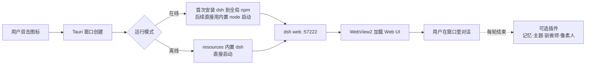
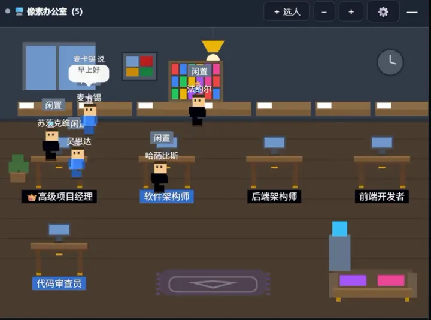
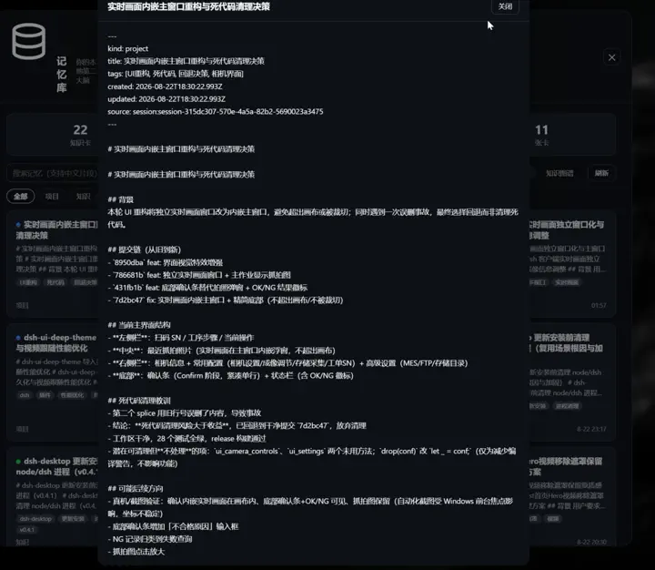

<div align="center">
  
  <h1>🖥️ dsh-desktop · DeepSeek Harness 桌面工作台</h1>
  <h3>会动的桌面 · 记忆 · 主题 · 驯兽师 — 不用装 Node、不开终端、不敲命令，双击即用</h3>
  <p>
    
    
    
    
    
    
  </p>
  <p>
    <a href="https://gitee.com/eternalnight996/dsh-desktop/releases">📦 立刻下载</a> ·
    <a href="https://gitee.com/eternalnight996/dsh-desktop">🌟 Gitee</a> ·
    <a href="https://github.com/EternalNight996/dsh-desktop">🐙 GitHub</a> ·
    <a href="LICENSE">📄 License</a>
  </p>
</div>

<p align="center">
  
  <br/><em>会动的桌面：508 位像素专家在办公室里走来走去、互相闲聊、随时听你差遣</em>
</p>

---

> **一句话读懂**：基于官方 [deepseek-harness](https://github.com/deepseek-ai/deepseek-harness) 套一个**自包含桌面壳**——内置 Node sidecar 自动拉起 dsh、窗口加载其 Web UI，**不 fork、不改源码**，官方更新即用。
>
> 🧠 **记忆核心**（`dsh-memory-eternal`）· 🎨 **主题皮肤**（`dsh-theme`）· 🦾 **驯兽师内核**（`dsh-ui-three-body`）· 🧑‍💼 **像素办公室**（`dsh-ui-agents-pixe`）——四个原创插件按需一键加装，桌面壳默认不内置、不捆绑。

---

## 🔥 先看痛点：为什么需要「桌面壳」？

| # | 痛点（用 DSH 的每个人都遇到过） | 没桌面壳的后果 |
|---|---|---|
| 1 | **装 Node、装 npm、记命令** | 新人第一步就被劝退，终端黑窗口劝退一半 |
| 2 | **手动启动 `dsh web`** | 关掉就掉线，每次开会都要重新拉 |
| 3 | **dsh 引擎更新滞后** | 自己 `npm i -g @deepseek-ai/dsh` 才知道有新版本 |
| 4 | **没有桌面壳自动更新** | 装包后永远停在旧版本，要手动下载新安装包 |
| 5 | **没有托盘常驻** | 关窗口 = 进程没了，下次还得重新拉 |
| 6 | **无法离线零依赖** | 没有 Node、没有 WebView2 的客户电脑直接跑不起来 |

> 这不是 DSH 的硬伤，是「桌面壳」这一层本就该有人做。**解法，正是 dsh-desktop**：双击图标 = 全套环境就位 + 自动更新 + 托盘常驻 + 离线可选。

---

## ✨ 装上桌面壳之后：六道痛点逐一被解决

| 痛点 | 装上 dsh-desktop 后 | 靠什么实现 |
|---|---|---|
| ① 装 Node / 记命令 | **双击图标就完事**，终端、命令、Node 全消失 | Rust + Tauri 2 + 内置 node sidecar |
| ② 手动拉服务 | 启动自动拉起 dsh，**关窗口最小化到托盘**，进程常驻 | `tauri-plugin-shell` sidecar + tray-icon |
| ③ dsh 引擎更新滞后 | 启动后台查官方 npm 最新版，**设置窗口一键升级**，不打断 | 自动检测 + 手动一键，与终端 dsh 命令同源 |
| ④ 桌面壳自身更新 | 启动自检新版本 → **一键下载安装 → 自动重启**，不打扰 | `tauri-plugin-updater` + 双源互备（GitHub + Gitee） |
| ⑤ 没有托盘常驻 | **托盘常驻、秒开**；右键打开主窗口 / 设置 / 检查更新 / 退出 | tray-icon + 命令行管理 |
| ⑥ 无法离线 | 离线安装包内置 Node + WebView2 + dsh，**断网可装、断网可跑** | `tauri.offline.json` + 内置 dsh resources |



---

## 🧬 桌面壳设计：为什么是「Rust + Tauri 2」

桌面壳**不重新发明轮子**——对话、模型、agent 引擎全部交给官方 DSH，自己只做「拉起 + 窗口 + 自动更新 + 托盘」这一层。安装包小、内存占用低、跨平台原生 WebView。

| 维度 | 手 `npx dsh web` | Electron 壳 | **本壳（Tauri 2）** |
|---|---|---|---|
| 装 Node | 要 | 免 | **免** |
| 自动启动 dsh | ❌ 手动 | ✅ | ✅ |
| dsh 引擎更新 | 手动 npm | 手动 | **✅ 在线后台检查 + 一键升级；离线 `just update-offline` 一键** |
| 桌面壳自动更新 | ❌ | 手动 | **✅ 启动自检 + 一键更新** |
| 托盘常驻 / 秒开 | ❌ | 部分 | **✅** |
| 离线零依赖 | ❌ | 部分 | **✅（离线方案）** |
| 内置插件（开箱彩蛋） | ❌ 需自装 | ❌ 需自装 | ❌ 需自装（独立插件一键加装） |
| 像素人 / 508 角色管理 | ❌ | ❌ | ❌ 需自装（`dsh-ui-agents-pixe`） |
| 安装包体积 | — | ~200MB+ | **壳 ~12MB（+运行时）** |
| 内存占用 | — | 高 | **低** |

> **不内置任何插件**：桌面壳只做「壳」，所有功能由官方 DSH + 可选插件提供；插件想装哪个装哪个，不捆绑、不抢模型。

---

## 🖼️ 界面预览 · 原创插件全家桶

> 📸 全部真实抓屏。会动的桌面、主题、记忆、驯兽师内核都由**可选插件**提供，桌面壳默认不内置。

桌面壳本身只做「拉起 + 窗口 + 自动更新 + 托盘」，**不内置**任何可选插件（不抢模型、不堆功能）；以下四个原创插件按需一条命令加装，全部从 GitHub 源安装（不走 npm 避免重下 dsh）：

```sh
just install-plugins        # 一键装齐 4 个原创插件（Windows 也可双击 scripts/install-plugins.ps1）
```

### 🧑‍💼 会动的桌面 · 像素办公室（[dsh-ui-agents-pixe](https://github.com/EternalNight996/dsh-ui-agents-pixe)）
<p align="center">
  
  
</p>

**508 张完整角色卡**（The Agency 255 + agency-agents-zh 253，17 部门）；Canvas 2D 像素小人可站立、打字、踱步，浮层可拖动折叠缩放，选人即入列，闲聊可接 AI。

### 🎨 主题皮肤（[dsh-theme](https://github.com/EternalNight996/dsh-theme)）
<p align="center">
  
  
</p>

内置主题 / 静态图 / **动态 360 跟随视频**，一键换肤，桌面更像「活」的。

### 🧠 记忆核心（[dsh-memory-eternal](https://github.com/EternalNight996/dsh-memory-eternal)）
<p align="center">
  
  
</p>

对话自动沉淀**知识卡**到本地 Markdown Vault（去重 / 检索 / 知识图谱），零人工干预，纯本地。

### 🦾 驯兽师内核（[dsh-ui-three-body](https://github.com/EternalNight996/dsh-ui-three-body)）
<p align="center">
  
  
</p>

把「人话」翻译给智能体：第一性原理 + 需求剖析 + 极简沟通 + 最少 token；左上角悬浮一只萌宠做开关，设置面板可配内核档位。

### ⚙️ 自动更新
<p align="center">
  
</p>

「更新配置」入口已移至 dsh 工作栏底部 **设置** 之前（记忆 → 更新配置 → 设置）。点开即弹出独立**设置·更新配置窗口**：内置桌面壳与 dsh 双更新入口、版本与运行方式一览、随时一键升级。关闭主窗口会最小化到托盘，更新配置常驻托盘与设置窗口。

---

## 🚀 三步上手

| 步骤 | 做什么 | 多久 |
|---|---|---|
| **1️⃣ 下载** | 从 [Gitee Releases](https://gitee.com/eternalnight996/dsh-desktop/releases)（或 [GitHub Releases](https://github.com/EternalNight996/dsh-desktop/releases)）选你的平台 | 1 分钟 |
| **2️⃣ 安装** | 双击安装包，一路下一步 | 1 分钟 |
| **3️⃣ 双击运行** | 图标一点，自动启动，**直接开聊** | 10 秒 |

| 平台 | 安装包 |
|---|---|
| Windows | `*-setup.exe` / `.msi` |
| macOS | `.dmg` / `.app` |
| Linux | `.deb` / `.AppImage` / `.rpm` |

**安装小贴士**：

- **Windows**：双击 `setup.exe` → 一路「下一步」。若弹出 SmartScreen「已阻止运行」→ 点「更多信息」→「仍要运行」（未签名版正常现象）；装完桌面会出现图标。
- **macOS**：打开 `.dmg` → 把 App 拖进「应用程序」；首次打开提示「无法验证开发者」→ 右键图标 →「打开」。
- **Linux**：`.deb` 用 `sudo dpkg -i xxx.deb`（或双击）；`.AppImage` 先 `chmod +x` 再运行。

> 💡 想要完全离线？下载**离线安装包**（文件名带 `offline`）：Node + WebView2 + dsh 全内置，断网也能装、也能跑。

---

## 🎨 扩展：插件市场 + 更多插件

桌面壳**不内置**任何插件；所有插件都用统一 `dsh` 命令安装（桌面壳已把终端 `dsh` 统一到同一份，**零下载，不会重装 dsh**）。想第一个装**插件市场**（界面浏览/搜索/一键安装所有插件）：

```sh
dsh plugin add dshmarket
```

安装后重启桌面壳，设置页出现「插件市场」入口（[dsh-market/dsh-market](https://github.com/dsh-market/dsh-market)）。

**原创插件全家桶**（会动的桌面 / 主题 / 记忆 / 驯兽师内核）见上方「界面预览 · 原创插件全家桶」，`just install-plugins` 一键装齐；也可单独装某个：`dsh plugin --profile web add github:EternalNight996/<仓库名>`。

---

## ❓ 常见疑问（大白话版）

**Q：我需要会编程吗？**
A：完全不用。这是给「人」用的，双击就完事。

**Q：它和 DeepSeek Harness 是什么关系？**
A：它是 DeepSeek Harness 的「桌面皮肤 + 保姆」：负责帮你拉起服务、开窗口、加彩蛋；对话、模型配置还是官方原汁原味。

**Q：我的数据会传出去吗？**
A：角色、状态全在**本机**（`~/.dsh/`），纯本地、零外传、零 LLM 开销。

**Q：官方更新了怎么办？**
A：在线版桌面壳启动时**直接使用全局安装的 dsh**（`%APPDATA%\npm`，与终端 dsh 命令同源；首次联网自动安装到全局，后台只检查版本，发现新版提示你点击「更新 dsh」一键升级），桌面壳自身也自动更新——你不用管，永远最新；离线版由维护者 `just update-offline` 更新内置 dsh 后重新打包。

**Q：像素人会偷懒吗？**
A：会摸鱼（下班躺床），但该干活时打字飞快 —— 这才是真实的打工人。

**Q：关闭主窗口就退出了吗？**
A：不会。默认**最小化到托盘**、dsh 服务随桌面壳一并常驻后台；真正退出才用托盘右键「退出」。这也是「随叫随到」的实现。

---

## 🛠 命令速查（开发者）

| 命令 | 作用 |
|---|---|
| `just setup` | 安装 Tauri CLI（`cargo install tauri-cli --locked`）+ 全局化 dsh CLI |
| `just setup-dsh` | 仅全局化 dsh CLI（终端 `dsh` 命令直用） |
| `just setup-linux` | Ubuntu/Debian 系统依赖（仅 Linux） |
| `just vendor` | 准备运行时（node/npm sidecar + 内置 dsh） |
| `just install-plugins` | 一键部署 4 个原创插件到 web profile |
| `just dev` | 开发运行（Rust 热重载） |
| `just run` | 一键本地启动调试：增量构建后直接运行 debug 版 exe（比 dev 更快） |
| `just dist` | 当前平台 debug 构建 |
| `just release-win` | Windows NSIS 安装包（mac/linux 同理：`release-mac` / `release-linux`） |
| `just dist-offline` / `release-*-offline` | 离线构建（内置 WebView2 + dsh） |
| `just update` | 自动查 npm 官方 dsh 最新版并升级**全局 dsh**（`%APPDATA%\npm`，与桌面壳在线 dsh 同源） |
| `just update-offline` | 拉取最新 dsh 到离线 runtime（`vendor/dsh-runtime`） |
| `just keygen` | 生成更新签名密钥（一次性；私钥 `.tauri/updater.key` 已 gitignore） |
| `just icon` | 从 `assets/logo.png` 生成全套图标 |
| `just release-publish "说明"` | Windows 一键发布（带签名 NSIS → latest.json → GitHub Releases → 打 tag） |

完整构建流程 + 安装部署教程见 [docs/rules/09-user-manual.md](docs/rules/09-user-manual.md) 与 [docs/rules/05-adr/](docs/rules/05-adr/)。

---

## 📦 发布记录（精简版）

- **v0.5.0**：三道防线根治「崩溃没画面」——① 看门狗：dsh 进程崩溃后退避自动重启（1s→5s），用户无感恢复；② HTTP 200 真探活：替代 TCP ping，杜绝半死服务被复用导致白屏；③ 失败降级：连续崩溃后加载页显示崩溃原因（含插件名）+ 重试按钮；④ 客户端错误注入：SPA 模块加载失败时触发壳侧重启；⑤ 自动修复：一键移除问题插件条目并重启；⑥ 启动状态轮询：加载页实时感知后端状态
- **v0.4.x**：自动更新 + 双源互备；GitHub Actions 跨平台三平台构建签名 + Gitee 镜像同步；Gitee 大文件回退 GitHub 直链；非 Windows 平台编译门控修复
- **v0.3.x**：原创插件一键部署脚本 + README 重设计；压缩主 GIF 27MB→6.2MB
- **v0.2.x**：终端 dsh 命令路径自动统一；统一 `dsh` 命令替换 `npx`；自动更新 + 设置窗口实战打磨
- **v0.1.x**：首个 Tauri 2 桌面壳 + 离线 / 在线两套打包方案

详细版本见 [GitHub Releases](https://github.com/EternalNight996/dsh-desktop/releases)。

---

## 📄 License

[MIT](LICENSE)

---

<div align="center">
  <sub>如果这个「桌面壳 + 原创插件全家桶」对你有帮助，点个 ⭐ Star，或分享给同样需要它的朋友～</sub>
</div>

<div align="center"><sub>Built with ❤️ by EternalNight · 包装自 <a href="https://github.com/deepseek-ai/deepseek-harness">deepseek-harness</a></sub></div>